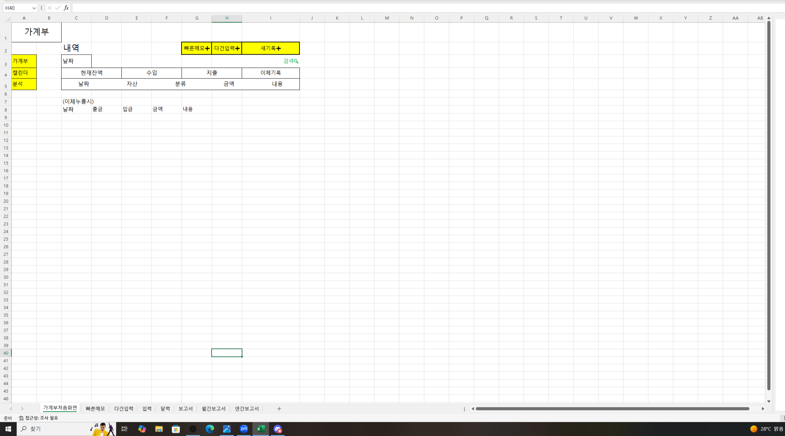
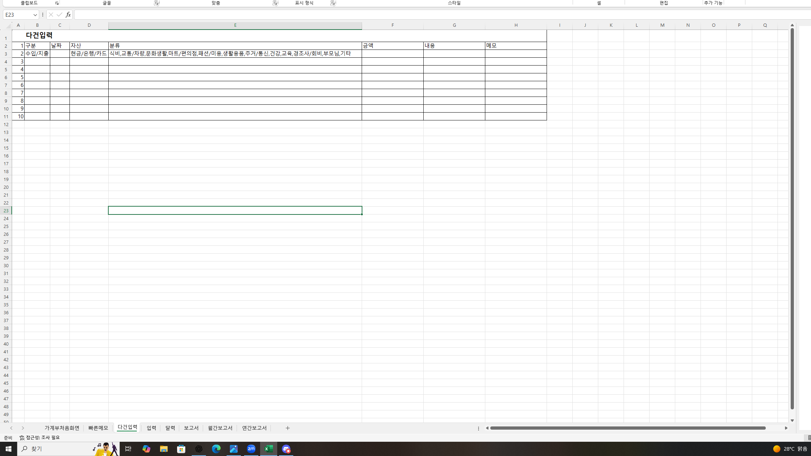
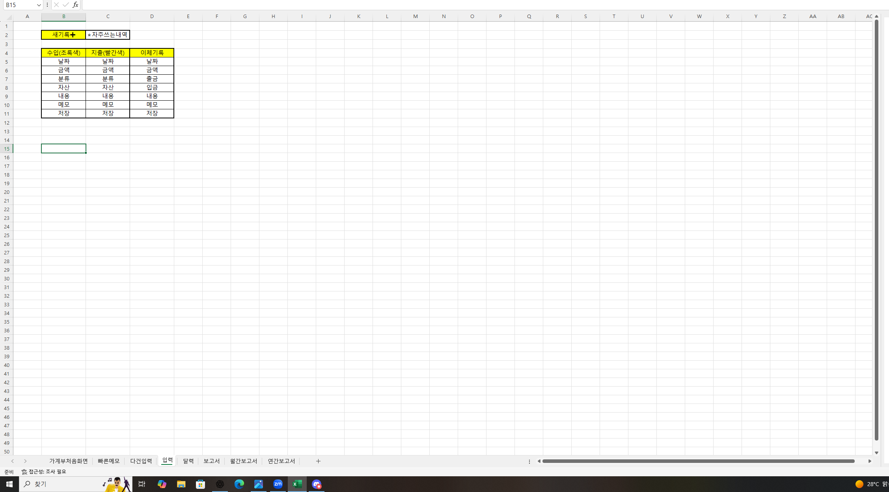
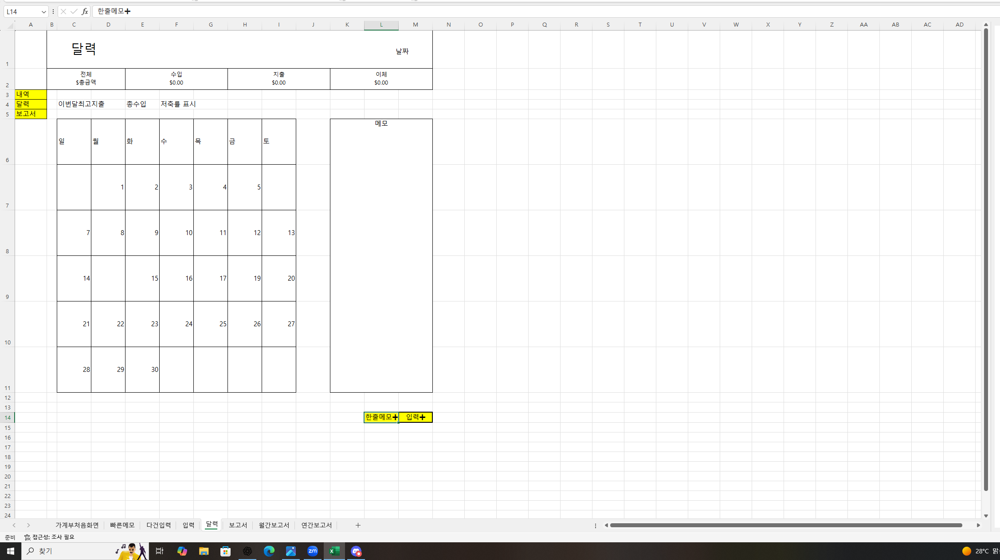

# 삼삼핀테크 (Samsam Fintech)

삼삼핀테크는 사용자의 스마트한 금융 생활을 돕기 위해 설계된 올인원 개인 금융 관리 플랫폼입니다. 금융 데이터 조회부터 계좌 관리, 가계부 작성, 그리고 통합 대시보드까지 다양한 기능을 제공하여 사용자가 자신의 재정 상태를 쉽게 파악하고 효율적으로 관리할 수 있도록 지원합니다.

## 설치 및 실행 방법

### 배포 링크
http://samsam.aimeta.p-e.kr/

### 테스트용 아이디
아이디 : samsam1    비밀번호 : 1234
아이디 : samsam2    비밀번호 : 12345678
아이디 : samsam3    비밀번호 : 12345678
아이디 : samsam4    비밀번호 : 12345678
아이디 : samsam5    비밀번호 : 12345678

기존 테스트용 계정을 사용하시면 쌓아둔 데이터의 정보를 볼 수 있습니다.
처음에는 테스트용 아이디로 둘러보시고 원하시면 그 이후에 계정을 생성해서 다시 해보시는 것을 추천드립니다.


### 팀원 구성 및 역할

*   **팀장:** 이연주 (세팅, 사용자 인증 및 계정 관리, 공통 템플릿, manage_account앱)
*   **팀원:**
    *   김승석 (dashboard앱)
    *   우창호 (세팅, 사용자 인증 및 계정 관리, transfers앱)
    *   이예린 (account_book앱)
    *   최진석 (financial_data앱, 구글게임광고)

## 주요 기능

*   **금융 데이터 및 투자 정보 (`financial_data` 앱):**
    *   주식, 환율 등 다양한 금융 데이터를 실시간으로 조회할 수 있습니다.
    *   투자 관련 정보를 얻고 자산 현황을 관리할 수 있습니다.
*   **계좌 관리 및 송금 (`manage_account`, `transfers` 앱):**
    *   여러 은행 계좌를 한곳에서 편리하게 관리할 수 있습니다.
    *   계좌 간 송금 기능을 통해 자금 이체를 간편하게 처리할 수 있습니다.
    *   거래 내역을 상세하게 조회하고 관리할 수 있습니다.
*   **가계부 (`account_book` 앱):**
    *   수입과 지출 내역을 기록하고 카테고리별로 분류하여 관리할 수 있습니다.
    *   월별, 연도별 재정 보고서를 통해 지출 패턴을 분석하고 예산을 계획할 수 있습니다.
*   **대시보드 (`dashboard` 앱):**
    *   모든 금융 활동(수입, 지출, 순자산)을 시각적으로 요약하여 보여줍니다.
    *   카테고리별 지출 분석, 월별 수입/지출 추이 그래프 등을 통해 재정 현황을 한눈에 파악할 수 있습니다.
*   **사용자 인증 (`acc_auth` 앱):**
    *   안전한 회원가입 및 로그인 기능을 제공합니다.

## 사용된 기술

*   **백엔드:** Python, Django
*   **데이터베이스:** SQLite (개발 환경), PostgreSQL(배포)
*   **프론트엔드:** HTML, CSS, JavaScript, Bootstrap
*   **차트 라이브러리:** Chart.js
*   **지도 서비스:** Google Maps API
*   **금융 데이터 API:** FinanceDataReader
*   **보고서 생성:** ReportLab, openpyxl


### 1. 필수 구성 요소 설치

*   Python 3.8 이상
*   pip (Python 패키지 관리자)
*   Git

### 2. 저장소 클론

```bash
git clone https://github.com/leeyonjoo150/samsam_fintech.git
cd samsam_fintech
```

### 3. 가상 환경 설정 및 활성화

```bash
python -m venv venv
# Windows
.\venv\Scripts\activate
# macOS/Linux
source venv/bin/activate
```

### 4. 의존성 설치

```bash
pip install -r requirements.txt
```

### 5. 데이터베이스 설정

```bash
python manage.py migrate
```

### 6. 더미 데이터 생성 (선택 사항)

테스트를 위해 더미 데이터를 생성할 수 있습니다.
(더미 데이터 생성 시 기존 데이터가 삭제될 수 있으므로 주의하십시오.)

```bash
python manage.py create_dummy_transactions --execute
# 기타 더미 데이터 생성 명령어가 있다면 여기에 추가
```

### 7. 관리자 계정 생성 (선택 사항)

```bash
python manage.py createsuperuser
```

### 8. 개발 서버 실행

```bash
python manage.py runserver
```

서버가 실행되면 웹 브라우저에서 `http://127.0.0.1:8000/` 또는 `http://localhost:8000/`으로 접속할 수 있습니다.

## 프로젝트 구조

```
samsam_fintech
├── config/             # 프로젝트 설정
├── acc_auth/           # 사용자 인증 및 계정 관리
├── account_book/       # 가계부 기능
├── dashboard/          # 통합 대시보드
├── financial_data/     # 금융 데이터 조회 및 관리
├── main/               # 메인 페이지 및 공통 템플릿
├── manage_account/     # 사용자 계좌 관리
├── transfers/          # 계좌 이체 및 거래 내역 관리
├── static/             # 정적 파일 (공통)
├── templates/          # 템플릿 (공통)
├── requirements.txt
├── manage.py
├── README.md
└── ... (기타 파일 및 디렉토리)
```

## 협업 과정

### 브랜치 전략

*   **`main` 브랜치:** 항상 배포 가능한 안정적인 코드를 유지합니다.
*   **`test-develop` 브랜치:** `main` 브랜치로 병합하기 전, 각 개발 브랜치의 내용을 수시로 통합하여 중간 테스트 및 검증을 수행하는      브랜치입니다. 이를 통해 안정적인 `develop` 브랜치 유지를 돕고, 최종 릴리즈 전 잠재적 문제를 조기에 발견합니다.
*   **개인 브랜치:** 각 팀원이 담당하는 앱 또는 기능 개발을 위해 생성하는 브랜치입니다. `test-develop` 브랜치로 병합하기 전까지 개인 작업 공간으로 활용됩니다.

### 커밋 컨벤션

*  추가 혹은 수정한 기능 또는 함수의 이름과 수정한 내용을 간략히 쉽게 알아볼 수 있도록 적었습니다.

### 이슈 관리 방법

*   개발 도중 의논사항 혹은 모델의 변경등이 있을 경우 팀원들을 모아 회의 후 정합니다.
*   개인브랜치로 병합할때 충돌이 난다면 기존 코드 당사자와 채팅에서 화면 공유로 같이 문제가 되는 부분에대해 논의 후 충돌 당사자가 수정하여 push까지 끝마칩니다.
*   하루에 한번씩 짧은 회의를 가져 각자 개발이 어디까지 진행됐는지 공유하고, 문제가 있다면 어떻게 해결해야 할지 논의해서 방향성을 정했습니다.

### 트러블 슈팅
*   최대한 처음 세팅시에 데이터베이스 설계를 세세하게 한다고 했음에도 개발하다보니 부족한 부분들이 생겼고 이를 팀원들과 강사님과 상의하여 발전시켰습니다.
*   병합과정에서 생기는 오류들을 기간 마지막에 처리하려다보니 병합 시간이 길어졌고 최종 담당자를 정하여 각자 발생한 오류를 여기저기서 해결하지 않고 한번에 처리 할 수 있도록 하였습니다.
*   개발시 사용한 데이터베이스와 배포용 데이터베이스를 어떻게 정할지 계속 의견이 분분하였고 마지막에 강사님의 도움을 받아 PostgreSQL로 공통 데이터베이스 서버를 구축하기로 하였습니다.

## 와이어프레임/목업

### manage_account, transfers


### financial_data

#### 금융데이터 검색


### account_book











## ERD 다이어그램

*   erd 클라우드를 사용하여 다이어그램 설계(erd 클라우드에 가입 후 로그인을 해야 볼 수 있음)
https://www.erdcloud.com/d/xDGX9szxoudKv6QzH


## 라이선스

이 프로젝트는 MIT 라이선스를 따릅니다. 자세한 내용은 `LICENSE` 파일을 참조하십시오.