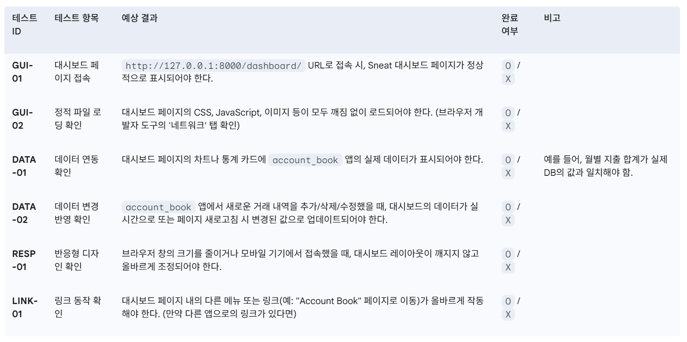

Sneat Dashboard 통합 후 작동 테스트 계획
1. 개요
이 문서는 'Sneat Dashboard' 템플릿을 'samsam_fintech' 프로젝트에 통합한 후, 모든 기능이 올바르게 작동하는지 확인하기 위한 테스트 항목들을 정의합니다.

2. 테스트 항목

3. 테스트 방법
자동화 도구: Cypress, Selenium 등을 사용하여 GUI 및 데이터 테스트를 자동화할 수 있습니다.

수동 테스트: 각 항목을 직접 확인하고, 브라우저의 개발자 도구를 활용하여 네트워크 요청 및 콘솔 로그를 확인합니다. 특히 Ctrl+Shift+I를 눌러 개발자 도구를 열고 'Console' 탭에 오류가 없는지 확인하는 것이 중요합니다.

협업: 팀원들과 함께 테스트를 진행하며, 발견된 버그를 공유하고 수정합니다.

4. 문제 해결 팁
정적 파일 문제: python manage.py collectstatic 명령어를 실행해보거나, settings.py의 STATICFILES_DIRS 경로를 다시 확인합니다.

템플릿 로딩 문제: TEMPLATES 설정의 DIRS 경로를 확인합니다.

데이터 연동 문제: views.py에서 print(context)를 사용하여 데이터가 올바르게 전달되는지 확인합니다. 또한, 브라우저의 '네트워크' 탭에서 요청과 응답을 확인하여 데이터 전송에 문제가 없는지 살펴봅니다.

safe 필터 누락: Django 템플릿에서 JSON 데이터를 넘길 때 |safe 필터를 사용하지 않으면, HTML이 데이터를 문자열로 인식하여 제대로 파싱되지 않을 수 있습니다.